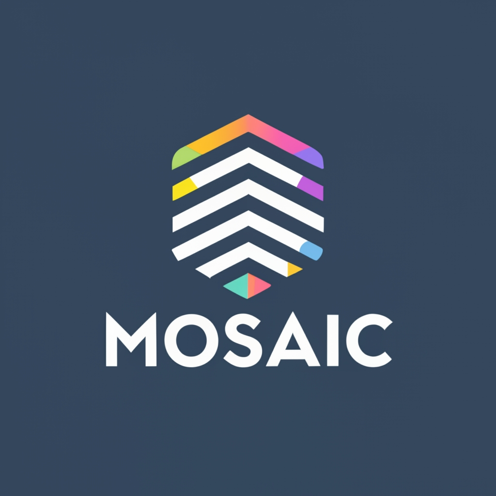
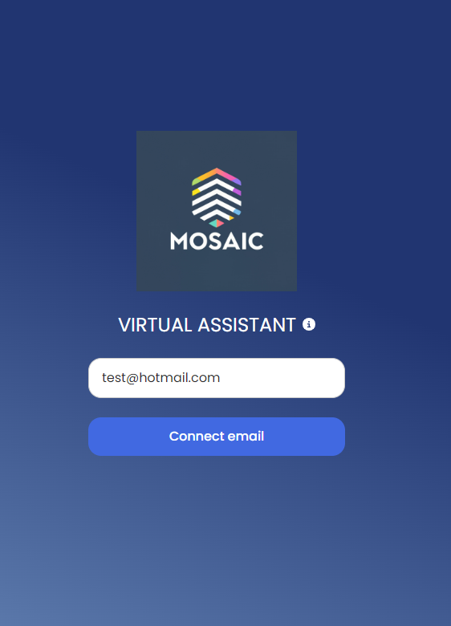
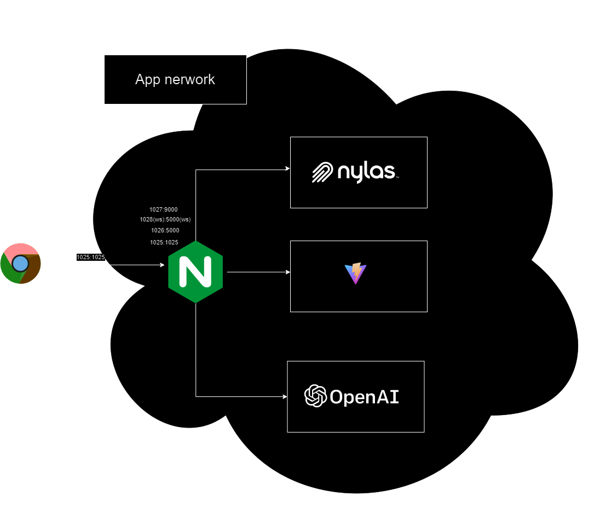

# Mosaic: Your AI-Powered Virtual Assistant

  



  

## Table of Contents

- [Mosaic: Your AI-Powered Virtual Assistant](#mosaic-your-ai-powered-virtual-assistant)
  - [Table of Contents](#table-of-contents)
  - [Introduction](#introduction)
  - [Features](#features)
  - [Getting Started](#getting-started)
    - [Prerequisites](#prerequisites)
    - [Installation](#installation)
  - [Usage](#usage)
    - [Enter your email and grant access to Nylas API for using Mosaic](#enter-your-email-and-grant-access-to-nylas-api-for-using-mosaic)
  - [How it works. Software Architecture.](#how-it-works-software-architecture)
    - [backend\_node:](#backend_node)
    - [backend:](#backend)
    - [frontend:](#frontend)
    - [nginx\_proxy:](#nginx_proxy)
  - [License](#license)
  - [brainstorming](#brainstorming)
  - [CREATIVE](#creative)
  - [PROMPT EXAMPLES:](#prompt-examples)
- [DEPLOYMENT](#deployment)

  

## Introduction

Mosaic is our proposal for the 2023 Hackaton  _Nylas and AI: Email and Calendaring for the Future_


Mosaic is a Personal AI-powered virtual assistant! it is a cutting-edge program that leverages artificial intelligence to help you efficiently manage your email, calendar, and contacts. Powered by Nylas API, Langchain, and OpenAI GPT-4 LLM (Large Language Model), Mosaic is designed to streamline your daily tasks and boost your productivity.

Whether you're a busy professional, an entrepreneur, or anyone looking to simplify email and calendar management, Mosaic is here to make your life easier. Say goodbye to email overload and the hassle of managing appointments and contacts manually.

You can manage your email, calendar, and contacts with Mosaic by simply typing or speaking your requests. Mosaic will process your instructions and assist you with email, calendar, and contact management.


We have created a video to show you how Mosaic works.

https://www.youtube.com/watch?v=vUeqKUegIpw

> What I think is going to happen in the next era of systems [...] We will have an increasing more powerful system that you will interact it through language
> [...] one of the things this systems can do is using tools. These tools is a big part of the big research area now 
>
> Demis Hassabigs - Co-Founder and CEO of DeepMind
## Features

Mosaic offers a wide range of features to simplify your life:

  

-  ✉️ **Email Management:** Mosaic uses Nylas API to intelligently categorize, filter, and prioritize your emails. Say goodbye to sifting through cluttered inboxes.

-  🗓️ **Calendar Assistant:** Never miss an important appointment again. Mosaic helps you schedule meetings, set reminders, and manage your calendar effortlessly.

- 👥 **Contact Organization:** Keep your contacts in order with Mosaic. It uses AI to add or delete, making it easy to find the people you need. Using natural language!

-  🗨️ **Natural Language Processing:** Mosaic's LLM (Language Model) ensures seamless communication with your virtual assistant. Simply ask for what you need in plain language.

  

## Getting Started

You can install Mosaic locally or use the  [deployed version](http://146.190.113.226:1025/). We recommend to install it locally to have a full experience of the product, and insights on how it works, inspecting the logs, adding new Langchain actions/API calls ect...


### Prerequisites

  

Before you can start using Mosaic, make sure you have the following prerequisites in place (for a local installation):

  

- Python 3.7 or higher installed on your system.

- Node 18 installed on your system.

- Npm 9.3 or higher installed on your system.

- Access to the Nylas API key and clientId by using a Nylas Sandbox.

- Access to the openAI API key.

  

### Installation

  

1. Clone the Mosaic repository to your local machine:

  

```bash
git clone https://github.com/JoSeTe4ever/LLMozaic
```

  

2. Navigate to the project directory:

  

```bash
cd LLMozaic
```

  

3. Install the required dependencies in the different folders (backend, backend_node, frontend)):

  

for backend

```bash
pip install -r requirements.txt
```

for frontend

```bash
npm install
```

for backend_node

```bash
npm install
```

  

1. Configure Nylas API keys by creating a .env file with the first 4 values to be filled:

```bash
OPEN_API_KEY= #This is the openAI key
NYLAS_CLIENT_ID= #This can be obtained from a sandbox app in Nylas https://dashboard.nylas.com/applications/bpubuit9iv9zcoxgubqniinji/quickstart-guides
NYLAS_CLIENT_SECRET= #This can be obtained from a sandbox app in Nylas https://dashboard.nylas.com/applications/bpubuit9iv9zcoxgubqniinji/quickstart-guides
NYLAS_API_SERVER=https://api.nylas.com
FLASK_APP=server.py
```

  
This .env file must be copied to the backend and backend_node root folders. 
Once these two .env files have been filled, you are ready to start Mosaic locally. You have two options

1. Start Mosaic, you can use docker-compose :
```bash
docker-compose up
```
Open a browser with the following link http://localhost:1025/


2. Another option to start Mosaic, is to open 3 tabs, go to the proper folder, and for each one run:
```bash
frontend npm run start
backend_node npm run start
backend python server.py
```
  Open a browser with the following link http://localhost:3000


## Usage


Mosaic works with any email account provider. Please enter your email in the login screen and grant Nylas access to your account. 
Mosaic will then sync your email, calendar, and contacts through this Nylas API. 

### Enter your email and grant access to Nylas API for using Mosaic

<p align="center">
  
</p>


There is also a speech to text option, that you can use by clicking on the microphone icon. 
This will allow you to speak to Mosaic and it will process your request.


⚠️ **this option only works from local since navigator.mediaTypes is not supported withouth https**

https://github.com/JoSeTe4ever/LLMozaic/assets/8459933/8526f7e1-c95a-462b-ad47-51d8020a4217


Mosaic is designed to be user-friendly and intuitive. Once you have it up and running, interact with your virtual assistant by simply typing or speaking your requests. Mosaic will process your instructions and assist you with email, calendar, and contact management.


⚠️ **Mosaic has no memory.** 

Please be patient with Mosaic, sometimes you must repeat them the previous request to get the desired result.


## How it works. Software Architecture.

Mosaic is a web application that is built using 4 services. These services are defined in the docker-compose.yml file, which is used by Docker Compose to start the application.

<p align="center">
  
</p>


### backend_node:

This service is a Node.js application that uses the Nylas API to retrieve email, calendar, and contact data from your email account. It uses the
Nylas Node SDK to communicate with the Nylas API, through a Sandbox applicationl. It is heavly based on the Nylas quickstart guide.

### backend:
This service is a Flask Server based in Python, that holds the Langchain Framework and the connection to OpenAI API. It gives the intelligence to the application, and it is the one that process the requests from the frontend, speciall the Websockets requests, since we are redirecting the _stdout_ of the python script to the frontend using a Websocket to give better User experience.

This is the core of the AI, and it is heavly based on the Langchain tool mechanics. It allows us to create an agent that uses our defined tools to process the requests from the user.

### frontend:
This service is a React application that provides the user interface for the application. It is a Vite server that gives the user an SPA using React. and it is the one that process the requests from the user, and send them to the backend service using the Websocket.

### nginx_proxy:

It maps several ports (1025, 1026, 1027, 1028) inside the container to the same ports on the host machine. It is kind of an API gateway, that redirects the requests to the proper service.


These services work together to form a web application stack, our dear Mosaic Virtual Assistant. 
The backend service communicates with the backend_node service, and the frontend service depends on the backend service. The Nginx proxy is used to handle incoming web traffic and route it to the appropriate services.

## License

  

Mosaic is released under the Apache License 2.0. Feel free to use, modify, and distribute this software in accordance with the terms of the license.

  

Thank you for choosing Mosaic as your virtual assistant. We hope it revolutionizes the way you manage your email, calendar, and contacts! If you have any questions or feedback, please don't hesitate to reach out to our support team.


Happy organizing!

[Contact Support](mailto:josete4ever@gmail.com)

  

## brainstorming

  These are the links we used during the development of the hackaton

- https://medium.com/devgauge/create-your-own-custom-tailored-ai-powered-personal-assistant-using-langchainagentfactory-8573cc2f67bc

- https://raw.githubusercontent.com/tjperry07/spec-testing/master/api.yaml NYLAS OPEN API DEF

- https://www.geeksforgeeks.org/build-chatbot-webapp-with-langchain/

- https://github.com/langchain-ai/langchain/issues/4884

- https://blog.langchain.dev/structured-tools/

- https://developer.nylas.com/docs/calendar/parse-contacts-from-events/

- https://github.com/zahidkhawaja/langchain-chat-nextjs

- https://blog.langchain.dev/conversational-retrieval-agents/

- https://www.pinecone.io/learn/series/langchain/langchain-agents/

- https://www.kaggle.com/code/robalaban/using-langchain-to-query-google-calendar-events/notebook

- https://www.piesocket.com/websocket-tester

- https://developer.mozilla.org/en-US/docs/Web/API/MediaStream_Recording_API/Using_the_MediaStream_Recording_API

- https://artificialcorner.com/how-to-build-tool-using-agents-with-langchain-d9fa9674b6c7

- https://stackoverflow.com/questions/76329949/i-cant-get-the-langchain-agent-module-to-actually-execute-my-prompt

- https://codepen.io/lxls/project/editor/ZKKBJa

- https://github.com/addpipe/simple-recorderjs-demo

- https://gist.github.com/pixeline/6d57e68aa6c1357b14c14fe8e3b4b963#deploy-docker-compose-on-digitalocean

- https://app.diagrams.net/


## CREATIVE

- https://shots.so/ for creating the video.
- https://ideogram.ai/ for creating the logo
- http://animista.net for web animations

 
## PROMPT EXAMPLES:

  

- Summarize the last email I received regarding Silicon Valley Bank.

- Send a happy birthday email to my friend John Doe with a picture of a cake.

- read my last email

- respond to this email sender test@gmail.com saying that life is great

- When is the best time to schedule a one hour workout

- Get all my events from now until next week (or next month)
  
  

# DEPLOYMENT

There is a deployed version of Mosaic under the following link:

http://146.190.113.226:1025/

This will be available until the Hackaton _Nylas and AI: Email and Calendaring for the Future_ finishes.
